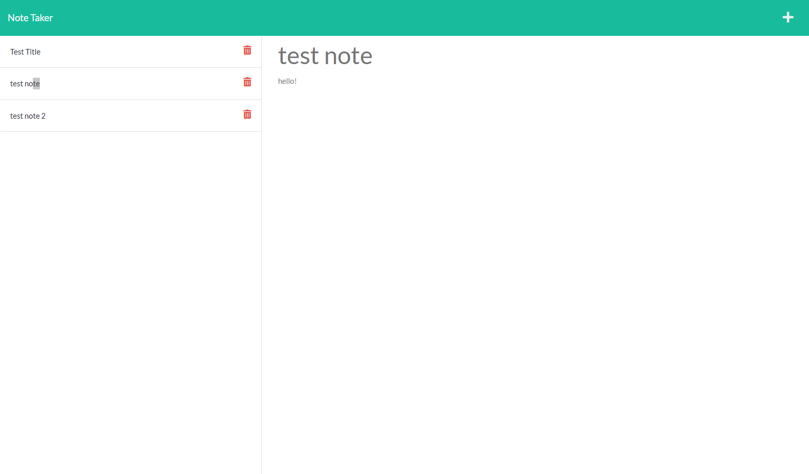

# Note Taker

## Table of Contents
- [Description](#description)
- [Installation](#installation)
- [Usage](#usage)
- [Credits](#credits)
- [Contact](#)

## Description

This application allows the user to write a custom note with a title and note body and then save that note to be viewed later. The note can then be deleted when it no longer needed.

## Installation

This application requires npm install to run 

## Usage

To use this application the user must visit the link here ('insert link when deployed') first click the 'Get Started' button which takes the user to the notes page. On the notes page the user will see a list of pre-written notes on the left. When one is clicked, the data for that note (title and note body) will populate on the right side of the page. When the user click the create new note button ('+') at the top right, a new note prompt will be created where the user can enter in the data for that note. Once done, a save button will appear directly to the left of the create new note button that will allow the user to save the note. If the note is no longer needed, the user may click the trash can icon (delete button) next to the note to remove it from the list. 

Below is an example of the notes page with saved notes in the list on the left:

## Credits

Credit for starter code goes to UC Berkeley Extension Program

## Contact Me

For any questions, please contact me via the channels below:
* Github: https://github.com/kaylaasana
* E-mail: kayladatte@gmail.com